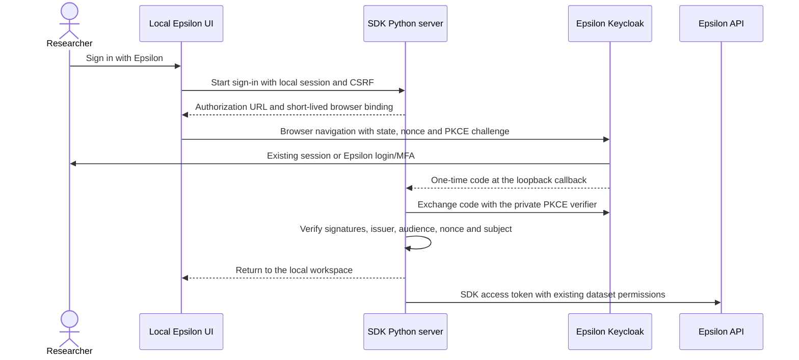

# Sign in with Epsilon from localhost

The current SDK UI uses the legacy username/password form, as requested. It calls
the same credential authentication service as `epsilon login` and stores only the
access token. The local browser unlock remains separate from account sign-in.

The browser authorization-code/PKCE implementation below is retained for a future
SSO rollout, along with its existing tests and configuration notes. It is no longer
the UI's sign-in action. The flow, screenshots and verification results below
describe that implementation, rather than the current default sign-in form.

## Flow



The callback uses the actual local port, for example
`http://127.0.0.1:7878/auth/callback`. No public tunnel, inbound cloud connection,
embedded identity form, browser token storage or client secret is required. The
researcher uses the same browser profile as their existing Epsilon session.

## How this relates to the existing repositories

- **ResearchWorkspace** already uses Keycloak authorization-code sign-in. Its
  hosted server uses a confidential client and server secret. The SDK instead
  uses the existing public SDK client with PKCE, because an installed Python
  application cannot keep a distributed client secret confidential.
- **Platform** already defines `sdk-client`, the `epsilon.api` audience and the
  `epsilon.sdk` scope. Its realm configuration needs the callback and PKCE update
  in [platform-client.patch](sso/platform-client.patch).
- **API** already validates issuer/audience and accepts the SDK bearer token on
  the analysis endpoints. Dataset/resource permission checks stay in those
  endpoints; no new password proxy or token-bypass route is needed.
- **epsilon-research-template** uses the installed SDK. The companion
  [documentation patch](sso/research-template.patch) explains browser sign-in,
  installation of this unreleased branch and institutional configuration.

## Platform configuration

Update the existing public SDK client's realm configuration:

```json
{
  "redirectUris": [
    "http://127.0.0.1/auth/callback",
    "http://localhost/auth/callback"
  ],
  "webOrigins": [],
  "attributes": {
    "pkce.code.challenge.method": "S256"
  }
}
```

Keep the existing client ID, public-client setting, scopes and audience. The
patch merges the PKCE attribute into the client; it does not replace other realm
clients. The existing direct credential grant remains available for older CLI
versions. Deprecating it is a separate rollout decision.

These settings are already added to the existing SDK client entry in the platform
repository's `dev/images/keycloak-config-cli/realm.json`. Both development and
production Compose files mount that same configuration directory. The existing
deployment starts `keycloak-config-cli` after Keycloak is healthy, so including
this change in a platform deployment applies it through the normal importer.
No additional importer service or manual Admin Console setup is required.
Keycloak retains the imported settings in its database across server restarts.

The existing local `keycloak-config-cli` container was rerun on 8 September 2026
and exited successfully (code `0`). The real local sign-in checks still passed
after that import, including rejection of unregistered callbacks and requests
without PKCE. The platform changes remain uncommitted on `feat/sdk-localhost-sso`.

Keycloak 25.0.6, the version pinned by the platform compose files, matches HTTP
loopback redirects with the actual client-selected port against the default-port
registration. Registering the exact callback path without a port supports
`epsilon start --port ...` without a broad URL wildcard. This behavior is visible
in [Keycloak's redirect validation](https://github.com/keycloak/keycloak/blob/25.0.6/services/src/main/java/org/keycloak/protocol/oidc/utils/RedirectUtils.java).

**Live activation remains a deployment step.** On 8 September 2026, a request
without credentials to the live `sdk-client` returned `Invalid parameter:
redirect_uri` for the new callback. The live discovery document confirms the
expected issuer and support for `S256`. Editing the platform repository does not
change the running Keycloak realm; apply the reviewed client update through the
normal platform configuration deployment before using this button with real
Epsilon accounts.

## Local configuration and storage

The production defaults are:

| Setting | Default |
| --- | --- |
| `EPSILON_SERVER_URL` | The SDK's configured server, normally `https://app.epsilon-data.org` |
| `EPSILON_SSO_ISSUER` | `https://app.epsilon-data.org/keycloak/realms/epsilon` for the default API server |
| `EPSILON_SSO_CLIENT_ID` | `sdk-client` |
| `EPSILON_SSO_AUDIENCE` | `epsilon.api` |
| `EPSILON_CREDENTIALS_PATH` | `~/.epsilon_sdk/credentials.ini` |

A different API server requires an explicit issuer. For local platform
development, for example, use `EPSILON_SSO_ISSUER=http://localhost:8080/realms/epsilon`
with the SDK configured for that local API. Only loopback identity services may
use HTTP; remote services require HTTPS. Settings come from the SDK environment,
not the browser or model.

### Use the existing local Docker platform

The local platform already has a Keycloak container on `epsilon_auth_internal`
and `epsilon_pg_auth`, with port `8080` published to the host. The Python SDK and
browser use that published port; the SDK does not need to join a Docker network.
Notebook execution retains `--network none`.

On 8 September 2026, the existing local `keycloak` container was started and its
existing **`sdk-client`** received the callback URLs and `S256` requirement above.
The public-client setting, legacy credential grant and SDK/API scopes remain
enabled. This changes local Docker Keycloak only. Local realm accounts and
sessions are separate from production Epsilon accounts.

From the research project, launch the branch-installed SDK with:

```bash
export EPSILON_SERVER_URL=http://localhost:3334
export EPSILON_SSO_ISSUER=http://localhost:8080/realms/epsilon
export EPSILON_CREDENTIALS_PATH="$HOME/.epsilon_sdk/local-credentials.ini"
epsilon start
```

The button now opens local Keycloak and returns to the SDK on port `7878` (or the
port passed to `epsilon start`). The alternate credentials file is shared by web
and CLI commands launched with these environment variables. Production credentials
and existing local projects remain in their original locations. The API override
does not edit the installed server default. To return to production, unset these
three variables and restart the SDK.

The local API listens on **3334** in the current API repository. It must be running
for dataset listing and downloads; authentication itself connects directly to
Keycloak. When starting the API from its repository, configure its issuer to
match the SDK's issuer exactly:

```bash
EPSILON_AUTH_URI=http://localhost:8080/realms/epsilon \
EPSILON_AUTH_ISSUER_BASE_URL=http://localhost:8080 \
pnpm start:dev
```

The API currently defaults to `http://keycloak:8080/realms/epsilon`. That is a
different issuer from `http://localhost:8080/realms/epsilon`, even when both reach
the same container. Use a consistent issuer for clients that should share local
SSO. The command above is for the API running on the host; `localhost` inside a
container refers to that container itself.

Verification against the real local Keycloak confirms the SDK opens its login
page, both callback ports `7878` and `7879` work, an unregistered external
callback is rejected, and a request without PKCE is rejected. No researcher
credentials were submitted during these checks. After adding the launch-scoped
configuration, **775 Python tests passed**, including the Docker notebook and
server checks. The local API was stopped during verification, so local dataset
downloads have not been tested.

Verified access and refresh tokens are stored in the existing CLI credentials
file with atomic writes and mode `0600`. The account password and ID token are
not stored. Tokens are bound to the API server, issuer, audience and client;
changing the API server cannot forward an old session to its new destination.
The shared API client refreshes expiring browser credentials for both web and CLI
requests, serializes refresh-token rotation, and backs off after an outage.
PyJWT with cryptography is a base SDK dependency so CLI environments can verify
refreshed credentials without installing the full workbench UI.

Signing out clears the SDK credentials and pending sign-in attempts, while local
projects remain. It does not end every Epsilon website session. The SDK does not
request offline access: central Keycloak sign-out ends the session used for
refresh, while an issued access token may remain usable until expiry. Keycloak
cannot push a backchannel logout request directly into an arbitrary researcher's
localhost server.

## Local request protection

The CLI launch link still unlocks the local workspace. Starting sign-in requires
that capability and a matching CSRF token. A cloud Epsilon account alone does not
unlock another person's local workspace.

Each attempt has cryptographically random state, nonce, PKCE verifier and a
separate browser binding. The verifier remains in Python memory. The binding is
an HttpOnly, ten-minute, SameSite=Lax cookie scoped to the callback; the workspace
capability remains SameSite=Strict. Only a top-level GET callback can cross the
normal origin boundary. Other project/API requests retain the existing rules.

The callback validates the attempt, origin, browser binding and active local
session before exchanging a code. It verifies token signatures and claims,
including the API audience and identity/access-token subject agreement, before
saving credentials. Attempts are single-use; cancellation, sign-out or a newer
attempt cannot be overwritten by a late token exchange.

A small loopback return document establishes the local browser origin before
loading the workspace. Its external module removes the consumed code from
history. Returned destinations are limited to local workspace routes. This
avoids relaxing Strict cookies or opening project routes to cross-site requests.

Discovery and token responses are bounded. Discovered endpoints must use the
configured issuer's origin, and token requests never follow HTTP redirects.
Errors use fixed messages; provider bodies, tokens and authorization codes do not
appear in the app's response messages. Outbound model checks include both saved
access and refresh tokens and do not refresh credentials while scanning source.

This follows the external-browser, public-client and loopback guidance in
[OAuth for Native Apps, RFC 8252](https://www.rfc-editor.org/rfc/rfc8252).

## Verification

Verified on 8 September 2026:

- **771 Python tests passed**, including real Docker/Jupyter execution and 35
  new SSO cases; **19 JavaScript tests**, ESLint and formatting checks passed.
- **15 browser SSO checks passed**: explicit external sign-in, cancellation,
  cross-site callback, preserved local capability, tokens absent from browser
  storage/account state, local sign-out, reuse of the identity-provider session
  and mobile layout. No browser runtime exceptions were recorded.
- Wheel/sdist builds and isolated wheel verification passed, including the
  callback module and the shared CLI token-verification dependency.
- Platform configuration verification confirms that only the existing SDK
  client gained the callback/PKCE configuration. Client count, other clients,
  API scopes/audience, claim mappings and the legacy grant are preserved.

Source changes are on `feat/local-research-workbench` in the SDK and
`feat/sdk-localhost-sso` in both platform and epsilon-research-template. They are
uncommitted and have not been pushed or published. The client registration is now
applied to local Docker Keycloak; production activation remains pending.

- [Desktop sign-in](workbench/previews/35-sign-in-with-epsilon.png)
- [Mobile sign-in](workbench/previews/36-sign-in-mobile.png)

Regression coverage is in `tests/test_sso.py`: PKCE, nonce/signature/issuer/audience
validation, cookie and CSRF binding, cross-site restrictions, expiry/replay,
cancellation, safe return destinations, bounded transport, token rotation,
revocation, sign-out races and API-server changes. Real browser checks use an
isolated identity-provider fixture with signed tokens and a real SDK server.
Successful sign-in with a production Epsilon account remains dependent on the
production platform registration being applied.
